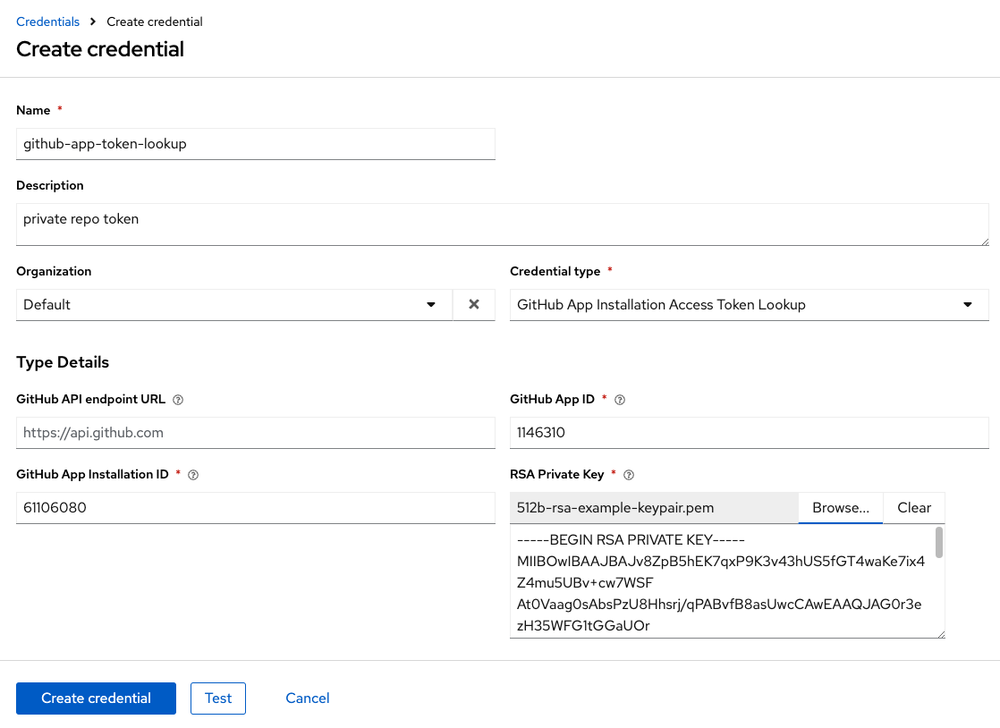
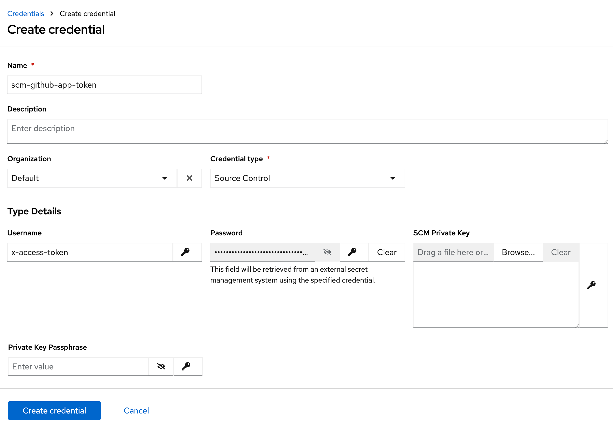
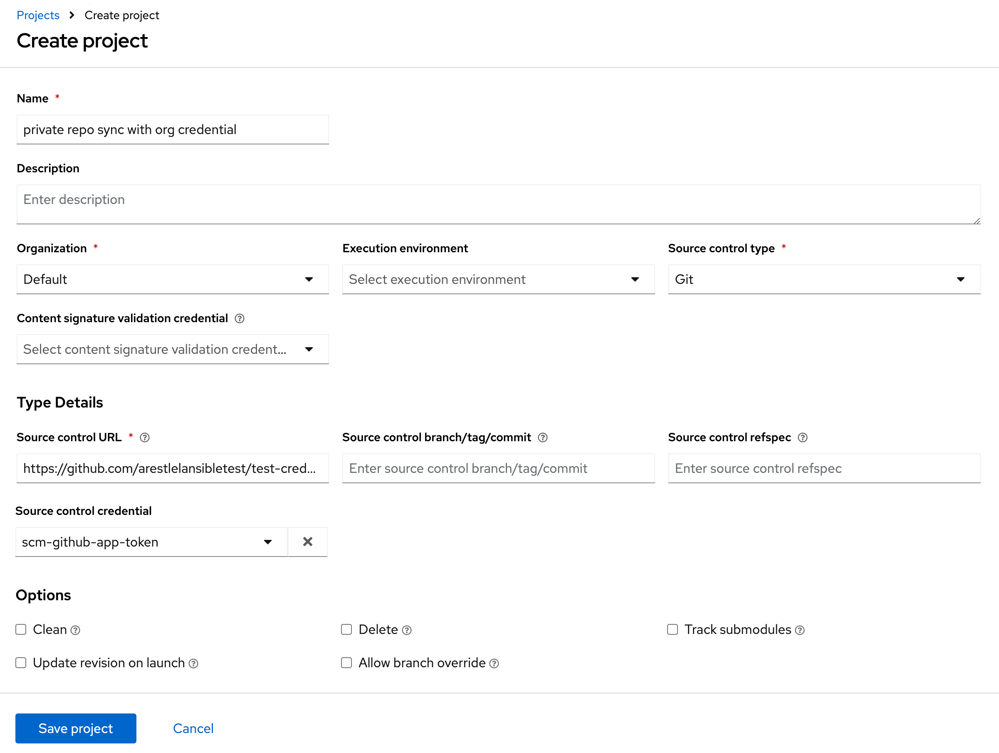
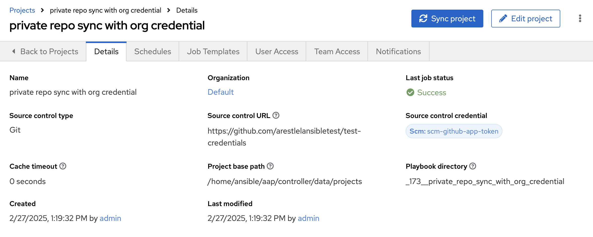

.. _ug_credential_plugins:

Secret Management System
=============================

.. index::
   single: credentials
   pair: credential; plugins
   pair: secret management; credential

Users and admins upload machine and cloud credentials so that automation can access machines and external services on their behalf. By default, sensitive credential values (such as SSH passwords, SSH private keys, API tokens for cloud services) are stored in the database after being encrypted. With external credentials backed by credential plugins, you can map credential fields (like a password or an SSH Private key) to values stored in a secret management system instead of providing them to AWX directly. AWX currently provides a secret management system that include integrations for:

- :ref:`ug_credentials_github_app_lookup`

These external secret values will be fetched prior to running a playbook that needs them.

Configure and link secret lookups
-----------------------------------

When configuring AWX to pull a secret from a 3rd-party system, it is in essence linking credential fields to external systems. To link a credential field to a value stored in an external system, select the external credential corresponding to that system and provide metadata to look up the desired value. The metadata input fields are part of the external credential type definition of the source credential.

AWX provides a credential plugin interface for developers, integrators, admins, and power-users with the ability to add new external credential types to extend it to support other secret management systems. For more detail, see the `development docs for credential plugins`_.

.. _`development docs for credential plugins`: https://github.com/ansible/awx/blob/devel/docs/credentials/credential_plugins.md

Use the AWX User Interface to configure and use each of the supported 3-party secret management systems.

1. First, create an external credential for authenticating with the secret management system. See :ref:`ug_credentials_add`. At minimum, provide a name for the external credential and select your desired secret lookup from the **Credential Type** drop-down menu.

2. Navigate to the credential form of the target credential and link one or more input fields to the external credential along with metadata for locating the secret in the external system. In this example, the *Demo Credential* is the target credential.

.. _ag_credential_plugins_link_step:

3. For any of the fields below the **Type Details** area that you want to link to the external credential, click the |key| button of the input field. You are prompted to set the input source to use to retrieve your secret information.

4. Select the credential you want to link to, and enter the **Metadata** of the input source. Metadata is specific to the input source you select.

5. Click **Test** to verify connection to the secret management system. If the lookup is unsuccessful, an error message with a noted exception displays.

6. When done, click **OK**. This closes the prompt window and returns you to the Details screen of your target credential. **Repeat these steps**, starting with :ref:`step 3 above <ag_credential_plugins_link_step>` to complete the remaining input fields for the target credential. By linking the information in this manner, AWX retrieves sensitive information, such as username, password, keys, certificates, and tokens from the 3rd-party management systems and populates that data into the remaining fields of the target credential form.

7. If necessary, supply any information manually for those fields that do not use linking as a way of retrieving sensitive information.

8. Click **Save** when done.

.. _ug_credentials_github_app_lookup:

GitHub App Token Lookup
~~~~~~~~~~~~~~~~~~~~~~~~~~
.. index::
   pair: credential types; GitHub app token

This plugin allows a GitHub app token to be used as a credential input source to pull secrets from GitHub App. AWX uses existing GitHub auth from organizations' GitHub repos. Refer to `Generating an installation access token for a GitHub App <https://docs.github.com/en/apps/creating-github-apps/authenticating-with-a-github-app/generating-an-installation-access-token-for-a-github-app>`_ for more detail.

1. Create a lookup credential that stores your secrets. See :ref:`ug_credentials_add` for detail.

2. When **GitHub App Installation Access Token lookup** is selected for **Credential Type**, provide the following attributes to properly configure your lookup:

- **GitHub App ID** (required): provide the app ID used for communicating with your GitHub App
- **GitHub App Installation ID** (required): ID of the installation that you want to authenticate as
- **RSA Private Key** (required): provide the generated private key obtained by the GitHub organization which your repo resides. See `Managing private keys for GitHub Apps <https://docs.github.com/en/apps/creating-github-apps/authenticating-with-a-github-app/managing-private-keys-for-github-apps>`_

Below shows an example of a configured GitHub app token lookup credential.

3. Click **Create Credential** to confirm and save the credential.

4. Create a target credential that looks up the lookup credential. To use your lookup in a private repo, use **Source Control** as your Credential type. Provide the following attributes to properly configure your target credential:

- **Username**: provide the username of ``x-access-token``
- **Password** (required): click the |key| button of the input field. You are prompted to set the input source to use to retrieve your secret information - this is the credential that you created in the previous step.

5. Enter an optional description for the metadata requested and click **Finish**.

6. Click **Create Credential** to confirm and save the credential.

7. Verify both your lookup credential and your target credential are now available on the Credentials list view.

8. To use the target credential in a project, create a project and supply the following information:

- **Name** (required): provide the name for your project
- **Organization** (required): select the name of the organization from the drop-down menu
- **Execution environment**: optionally select an execution environment, if applicable
- **Source control type** (required): If you are syncing with a private repo, select **Git** for your source control.

The **Type Details** pane opens for additional input. Provide the following information:

- **Source control URL** (required): enter the URL of the private repo you want to access. The other related fields pertaining to **branch/tag/commit** and **refspec** are not pertinent for use with a lookup credential.
- **Source control credential**: Select the target credential that you created in the previous step

9. Click **Save** and the project sync automatically starts and the project Details displays the progress of the job.

.. note::

   If your project sync fails, you may have to manually re-enter ``https://api.github.com/`` in the **GitHub API endpoint URL** field from Step 2 and re-run your project sync.
