.. _ug_credentials:

Credentials
===============

.. index::
   single: credentials

Credentials are utilized for authentication when launching Jobs against machines, synchronizing with inventory sources, and importing project content from a version control system.

You can grant users and teams the ability to use these credentials, without actually exposing the credential to the user. If you have a user move to a different team or leave the organization, you don’t have to re-key all of your systems just because that credential was available in AWX.

.. _how_credentials_work:

Understanding How Credentials Work
------------------------------------

.. index::
    pair: credentials; how they work

AWX uses SSH to connect to remote hosts (or the Windows equivalent).  In order to pass the key from AWX to SSH, the key must be decrypted before it can be written a named pipe. AWX then uses that pipe to send the key to SSH (so that it is never written to disk).

If passwords are used, AWX handles those by responding directly to the password prompt and decrypting the password before writing it to the prompt.

Getting Started with Credentials
----------------------------------

.. index::
   pair: credentials; getting started

Click **Credentials** from the left navigation bar to access the Credentials page. The Credentials page displays a search-able list of all available Credentials and can be sorted by **Name**.

Credentials added to a Team are made available to all members of the Team, whereas credentials added to a User are only available to that specific User by default.

To help you get started, a Demo Credential has been created for your use.

Clicking on the link for the **Demo Credential** takes you to the **Details** view of this Credential.

|Credentials - home with demo credential details|

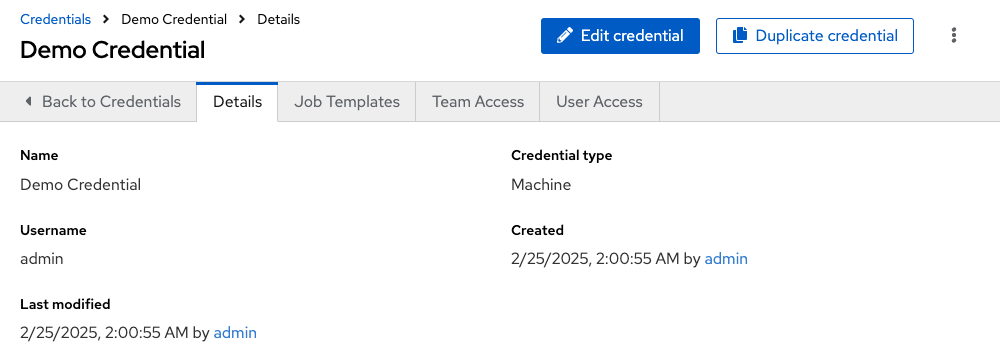

Clicking the **Team Access** tab shows you users and teams associated with this Credential and their granted roles (owner, admin, auditor, etc.)

.. note::

  A credential with roles associated will retain them even after the credential has been reassigned to another organization.

You can click the **Add** button to assign this **Demo Credential** to additional users. If no users exist, add them from the **Users** menu.

Clicking the **Job Templates** tab shows you the job templates associated with this Credential and which jobs recently ran using this particular credential.

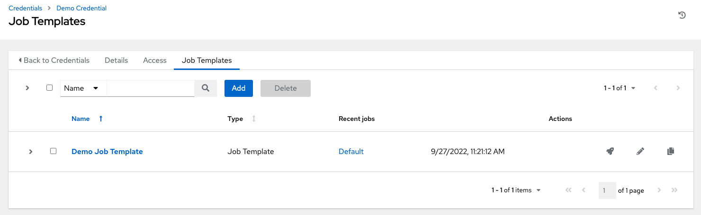

You can click the **Add** button to assign this **Demo Credential** to additional job templates.

.. _ug_credentials_add:

Add a New Credential
----------------------

.. index::
   pair: credentials; adding new

To create a new credential:

1. Click the **Create credential** button from the **Credentials** screen.

|Create credential|

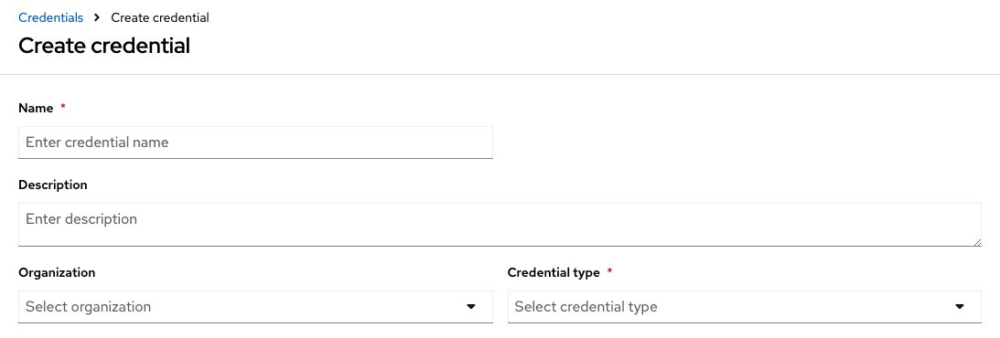

2. Enter the name for your new credential in the **Name** field.

3. Optionally enter a description and enter or select the name of the organization with which the credential is associated.

.. note::

  A credential with a set of permissions associated with one organization will remain even after the credential is reassigned to another organization.

4. Enter or select the credential type you want to create.

5. Enter the appropriate details depending on the type of credential selected, as described in the next section, :ref:`ug_credentials_cred_types`.

6. Click **Save** when done.

.. _ug_credentials_cred_types:

Credential Types
-----------------

.. index::
   single: credentials; types
   single: credential types

The following credential types are supported with AWX:

- :ref:`ug_credentials_galaxy`
- :ref:`ug_credentials_registry`
- :ref:`ug_credentials_machine`
- :ref:`ug_credentials_network`
- :ref:`ug_credentials_ocp_k8s`
- :ref:`ug_credentials_aap`
- :ref:`ug_credentials_scm`
- :ref:`ug_credentials_vault`

Certain credential types are associated with credential plugins capability that allows an external system to lookup your secrets information. See the :ref:`ug_credential_plugins` section for further detail.

.. _ug_credentials_galaxy:

Ansible Galaxy/Automation Hub API Token
^^^^^^^^^^^^^^^^^^^^^^^^^^^^^^^^^^^^^^^^^^
.. index::
   pair: credential types; Galaxy
   pair: credential types; Automation Hub

Selecting this credential allows AWX to access Galaxy or use a collection published on a local hub.  Entering the Galaxy server URL is the only required value on this screen.

|Credentials - create galaxy credential|

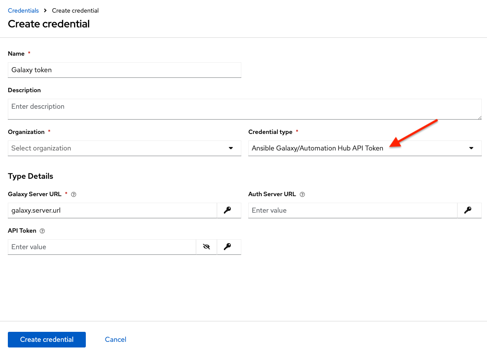

To populate the Server URL fields, refer to the `Galaxy community documentation <https://ansible.readthedocs.io/projects/galaxy-ng/en/latest/community/userguide/>`_ for information.

.. _ug_credentials_registry:

Container Registry
^^^^^^^^^^^^^^^^^^^
.. index::
   pair: credential types; Container Registry

Selecting this credential allows AWX to access a collection of container images. See `What is a container registry? <https://www.redhat.com/en/topics/cloud-native-apps/what-is-a-container-registry>`_ for more information.

Aside from specifying a name, the **Authentication URL** is the only required field on this screen, and it is already pre-populated with a default value. You may change this default by specifying the authentication endpoint for a different container registry.

|Credentials - create container credential|

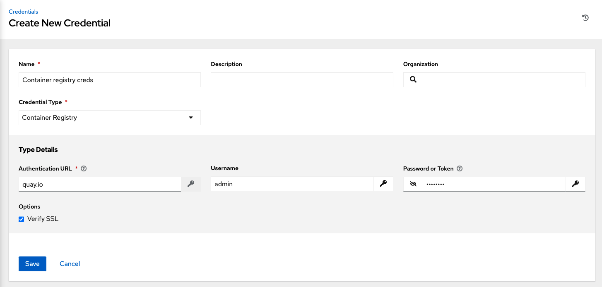

.. _ug_credentials_machine:

Machine
^^^^^^^^

.. index::
   pair: credential types; machine

Machine credentials enable AWX to invoke Ansible on hosts under your management. Just like using Ansible on the command line, you can specify the SSH username, optionally provide a password, an SSH key, a key password, or even have AWX prompt the user for their password at deployment time. They define ssh and user-level privilege escalation access for playbooks, and are used when submitting jobs to run playbooks on a remote host. Network connections (``httpapi``, ``netconf``, and ``network_cli``) use **Machine** for the credential type.

Machine/SSH credentials do not use environment variables. Instead, they pass the username via the ``ansible -u`` flag, and interactively write the SSH password when the underlying SSH client prompts for it.

|Credentials - create machine credential|

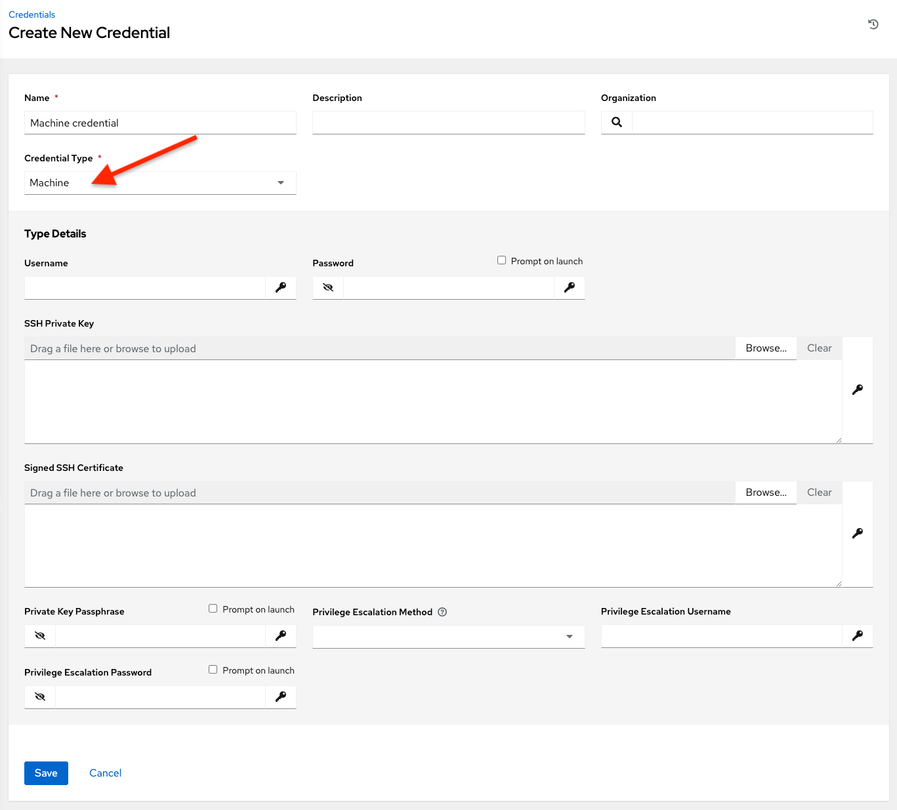

Machine credentials have several attributes that may be configured:

- **Username**: The username to be used for SSH authentication.
- **Password**: The actual password to be used for SSH authentication. This password will be stored encrypted in the database, if entered. Alternatively, you can configure AWX to ask the user for the password at launch time by selecting **Prompt on launch**. In these cases, a dialog opens when the job is launched, promoting the user to enter the password and password confirmation.
- **SSH Private Key**: Copy or drag-and-drop the SSH private key for the machine credential.
- **Private Key Passphrase**: If the SSH Private Key used is protected by a password, you can configure a Key Password for the private key. This password will be stored encrypted in the database, if entered. Alternatively, you can configure AWX to ask the user for the password at launch time by selecting **Prompt on launch**. In these cases, a dialog opens when the job is launched, prompting the user to enter the password and password confirmation.
- **Privilege Escalation Method**: Specifies the type of escalation privilege to assign to specific users. This is equivalent to specifying the ``--become-method=BECOME_METHOD`` parameter, where ``BECOME_METHOD`` could be any of the typical methods described below, or a custom method you've written. Begin entering the name of the method, and the appropriate name auto-populates.

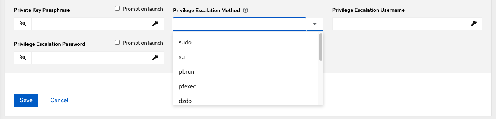

- empty selection: If a task/play has ``become`` set to ``yes`` and is used with an empty selection, then it will default to ``sudo``
- **sudo**: Performs single commands with super user (root user) privileges
- **su**: Switches to the super user (root user) account (or to other user accounts)
- **pbrun**:  Requests that an application or command be run in a controlled account and provides for advanced root privilege delegation and keylogging
- **pfexec**: Executes commands with predefined process attributes, such as specific user or group IDs
- **dzdo**: An enhanced version of sudo that uses RBAC information in an Centrify's Active Directory service (see Centrify's `site on DZDO <https://docs.delinea.com/online-help/server-suite/reports-events/events/server-suite/dzdo.htm>`_)
- **pmrun**: Requests that an application is run in a controlled account (refer to `Privilege Manager for Unix <https://support.oneidentity.com/privilege-manager-for-unix/7.4>`_)
- **runas**: Allows you to run as the current user
- **enable**: Switches to elevated permissions on a network device
- **doas**: Allows your remote/login user to execute commands as another user via the doas ("Do as user") utility
- **ksu**: Allows your remote/login user to execute commands as another user via Kerberos access
- **machinectl**: Allows you to manage containers via the systemd machine manager
- **sesu**: Allows your remote/login user to execute commands as another user via the CA Privileged Access Manager

.. note::
   Custom ``become`` plugins are available only starting with Ansible 2.8. For more detail on this concept, refer to `Understanding Privilege Escalation <https://docs.ansible.com/ansible/latest/user_guide/become.html>`_ and the `list of become plugins <https://docs.ansible.com/ansible/latest/plugins/become.html#plugin-list>`_.

- **Privilege Escalation Username** field is only seen if an option for privilege escalation is selected. Enter the username to use with escalation privileges on the remote system.
- **Privilege Escalation Password**: field is only seen if an option for privilege escalation is selected. Enter the actual password to be used to authenticate the user via the selected privilege escalation type on the remote system. This password will be stored encrypted in the database, if entered. Alternatively, you may configure AWX to ask the user for the password at launch time by selecting **Prompt on launch**. In these cases, a dialog opens when the job is launched, promoting the user to enter the password and password confirmation.

.. note::
   Sudo Password must be used in combination with SSH passwords or SSH Private Keys, since AWX must first establish an authenticated SSH connection with the host prior to invoking sudo to change to the sudo user.

.. warning::
   Credentials which are used in *Scheduled Jobs* must not be configured as "**Prompt on launch**".

.. _ug_credentials_network:

Network
^^^^^^^^

.. index::
   pair: credential types; network

Select the Network credential type **only** if you are using a ``local`` connection with ``provider`` to use Ansible networking modules to connect to and manage networking devices. When connecting to network devices, the credential type must match the connection type:

- For ``local`` connections using ``provider``, credential type should be **Network**
- For all other network connections (``httpapi``, ``netconf``, and ``network_cli``), credential type should be **Machine**

For an overview of connection types available for network devices, refer to `Multiple Communication Protocols`_.

  .. _`Multiple Communication Protocols`: https://docs.ansible.com/ansible/devel/network/getting_started/network_differences.html#multiple-communication-protocols.

AWX uses the following environment variables for Network credentials and are fields prompted in the user interface:

::

  ANSIBLE_NET_USERNAME
  ANSIBLE_NET_PASSWORD

|Credentials - create network credential|

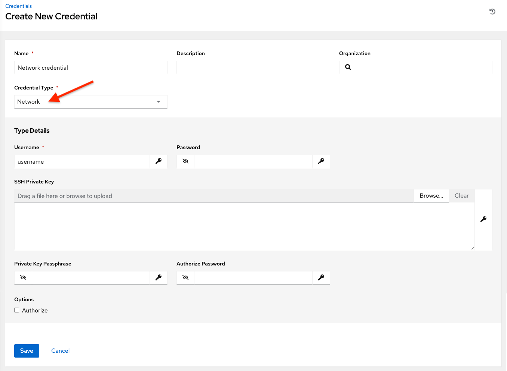

Network credentials have several attributes that may be configured:

-  **Username**: The username to use in conjunction with the network device (required).
-  **Password**:  The password to use in conjunction with the network device.
- **SSH Private Key**: Copy or drag-and-drop the actual SSH Private Key to be used to authenticate the user to the network via SSH.
-  **Private Key Passphrase**: The actual passphrase for the private key to be used to authenticate the user to the network via SSH.
-  **Authorize**: Select this from the Options field to control whether or not to enter privileged mode.
- If **Authorize** is checked, enter a password in the **Authorize Password** field to access privileged mode.

For more information, refer to the *Inside Playbook* blog, `Porting Ansible Network Playbooks with New Connection Plugins`_.

.. _`Porting Ansible Network Playbooks with New Connection Plugins`: https://www.ansible.com/blog/porting-ansible-network-playbooks-with-new-connection-plugins

.. _ug_credentials_ocp_k8s:

OpenShift or Kubernetes API Bearer Token
^^^^^^^^^^^^^^^^^^^^^^^^^^^^^^^^^^^^^^^^^

.. index::
   pair: credential types; OpenShift
   pair: credential types; Kubernetes
   pair: credential types; API bearer token

Selecting this credential type allows you to create instance groups that point to a Kubernetes or OpenShift container.

|Credentials - create Containers credential|

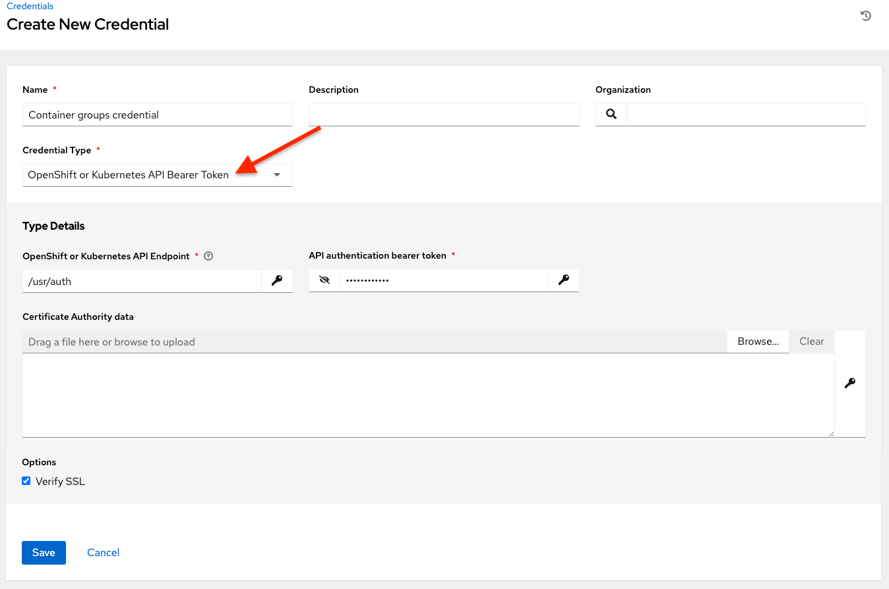

Container credentials have the following inputs:

- **OpenShift or Kubernetes API Endpoint** (required): the endpoint to be used to connect to an OpenShift or Kubernetes container
- **API Authentication Bearer Token** (required): The token to use to authenticate the connection
- **Verify SSL**: Optionally you can check this option to verify the server’s SSL certificate is valid and trusted. Environments that use internal or private CA’s should leave this option unchecked to disable verification.
- **Certificate Authority Data**: include the ``BEGIN CERTIFICATE`` and ``END CERTIFICATE`` lines when pasting the certificate, if provided

A ``ContainerGroup`` is a type of ``InstanceGroup`` that has an associated Credential that allows for connecting to an OpenShift cluster. To set up a container group, you must first have the following:

- A namespace you can launch into (every cluster has a “default” namespace, but you may want to use a specific namespace)
- A service account that has the roles that allow it to launch and manage Pods in this namespace
- If you will be using execution environments in a private registry, and have a Container Registry credential associated to them in AWX, the service account also needs the roles to get, create, and delete secrets in the namespace. If you do not want to give these roles to the service account, you can pre-create the ``ImagePullSecrets`` and specify them on the pod spec for the ContainerGroup. In this case, the execution environment should NOT have a Container Registry credential associated, or AWX will attempt to create the secret for you in the namespace.
- A token associated with that service account (OpenShift or Kubernetes Bearer Token)
- A CA certificate associated with the cluster

Create a Service Account in an Openshift cluster (or K8s) in order to be used to run jobs in a container group via AWX. After the Service Account is created, its credentials are provided to AWX in the form of an Openshift or Kubernetes API bearer token credential. Below describes how to create a service account and collect the needed information for configuring AWX.

To configure AWX:

1. To create a service account, you may download and use this sample service account, :download:`containergroup sa <_static/images/containergroup-sa.yml>` and modify it as needed to obtain the above credentials.

2. Apply the configuration from ``containergroup-sa.yml``::

    oc apply -f containergroup-sa.yml

3. Get the secret name associated with the service account::

    export SA_SECRET=$(oc get sa containergroup-service-account -o json | jq '.secrets[0].name' | tr -d '"')

4. Get the token from the secret::

    oc get secret $(echo ${SA_SECRET}) -o json | jq '.data.token' | xargs | base64 --decode > containergroup-sa.token

5. Get the CA cert::

    oc get secret $SA_SECRET -o json | jq '.data["ca.crt"]' | xargs | base64 --decode > containergroup-ca.crt

6. Use the contents of ``containergroup-sa.token`` and ``containergroup-ca.crt`` to provide the information for the :ref:`ug_credentials_ocp_k8s` required for the container group.

.. _ug_credentials_aap:

Red Hat Ansible Automation Platform
^^^^^^^^^^^^^^^^^^^^^^^^^^^^^^^^^^^

.. index::
   pair: credential types; automation platform

Selecting this credential allows you to access a Red Hat Ansible Automation Platform instance.

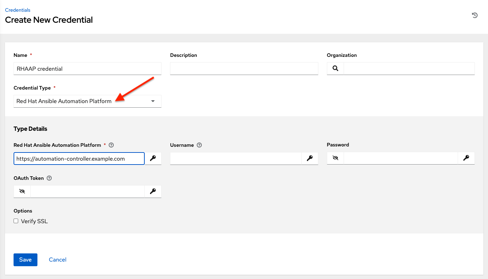

The Red Hat Ansible Automation Platform credentials have the following inputs that are required:

-  **Red Hat Ansible Automation Platform**: The base URL or IP address of the other instance to connect to.
-  **Username**: The username to use to connect to it.
-  **Password**: The password to use to connect to it.
-  **Oauth Token**: If username and password is not used, provide an OAuth token to use to authenticate.

.. _ug_credentials_scm:

Source Control
^^^^^^^^^^^^^^^^

.. index::
   pair: credential types; source control

SCM (source control) credentials are used with Projects to clone and update local source code repositories from a remote revision control system such as Git or Subversion.

|Credentials - create SCM credential|

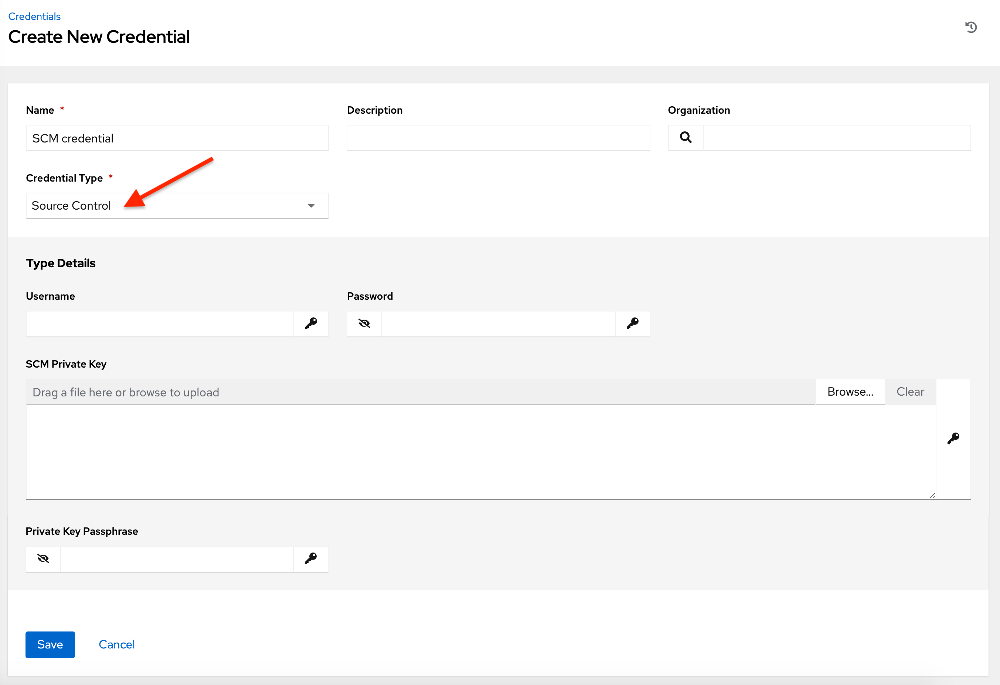

Source Control credentials have several attributes that may be configured:

-  **Username**: The username to use in conjunction with the source control system.
-  **Password**:  The password to use in conjunction with the source control system.
-  **SCM Private Key**: Copy or drag-and-drop the actual SSH Private Key to be used to authenticate the user to the source control system via SSH.
-  **Private Key Passphrase**: If the SSH Private Key used is protected by a passphrase, you may configure a Key Passphrase for the private key.

.. note::

    Source Control credentials cannot be configured as "**Prompt on launch**".
    If you are using a GitHub account for a Source Control credential and you have 2FA (Two Factor Authentication) enabled on your account, you will need to use your Personal Access Token in the password field rather than your account password.

.. _ug_credentials_vault:

Vault
^^^^^^^^

.. index::
   pair: credential types; Vault

Selecting this credential type enables synchronization of inventory with Ansible Vault.

|Credentials - create Vault credential|

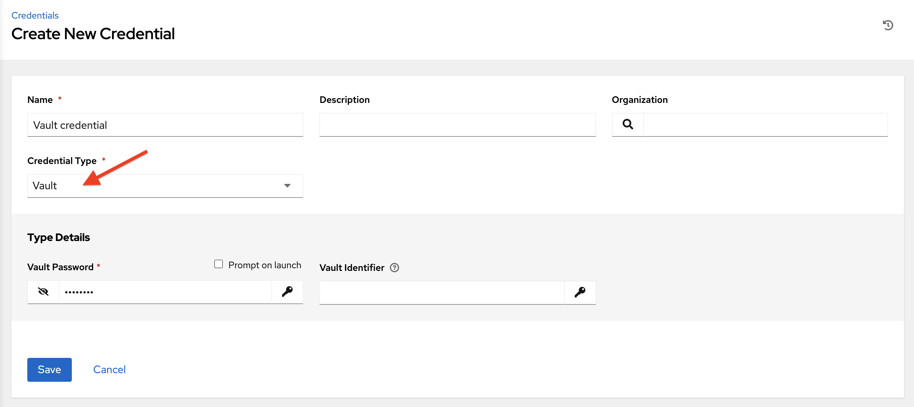

Vault credentials require the **Vault Password** and an optional **Vault Identifier** if applying multi-Vault credentialing. For more information on AWX Multi-Vault support, refer to the :ref:`ag_multi_vault`.

You may configure AWX to ask the user for the password at launch time by selecting **Prompt on launch**. In these cases, a dialog opens when the job is launched, promoting the user to enter the password and password confirmation.

.. warning::

    Credentials which are used in *Scheduled Jobs* must not be configured as "**Prompt on launch**".

For more information about Ansible Vault, refer to: http://docs.ansible.com/ansible/playbooks_vault.html
