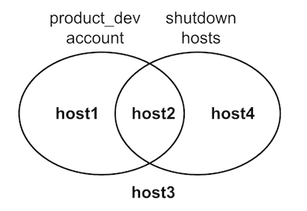
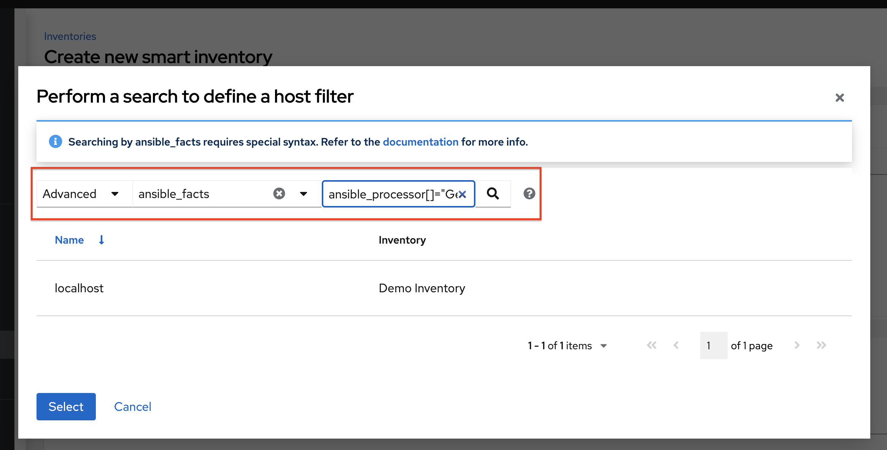

.. _ug_inventories:

*******************
Inventories
*******************

.. index::
   single: inventories

An Inventory is a collection of hosts against which jobs may be launched, the same as an Ansible inventory file. Inventories are divided into groups and these groups contain the actual hosts. Groups may be sourced manually, by entering host names into AWX, or from one of its supported cloud providers.

.. note::

    If you have a custom dynamic inventory script, or a cloud provider that is not yet supported natively in AWX, you can also import that into AWX. Refer to :ref:`ag_inv_import` for detail.

The Inventories window displays a list of the inventories that are currently available. The inventory list may be sorted by name and searched type, organization, description, owners and modifiers of the inventory, or additional criteria as needed.

The list of Inventory details includes:

- **Name**: The inventory name. Clicking the Inventory name navigates to the properties screen for the selected inventory, which shows the inventory's groups and hosts.

- **Status**: The statuses are:
    - **Success**: when the inventory source sync completed successfully
    - **Disabled**: no inventory source added to the inventory
    - **Error**: when the inventory source sync completed with error

- **Type**: Identifies whether it is a standard inventory, a Smart inventory, or a constructed inventory.
- **Organization**: The organization to which the inventory belongs.
- **Actions**: The following actions are available for the selected inventory:

    - **Edit**: Edit the properties for the selected inventory
    - **Copy**: Makes a copy of an existing inventory as a template for creating a new one

.. _ug_inventories_constructed:

Constructed Inventories
========================

.. index::
   pair: inventories; constructed

This feature allows creation of a constructed inventory from a list of input inventories. The constructed inventory contains copies of hosts and groups in its input inventories, allowing jobs to target groups of servers across multiple inventories. Groups and hostvars can be added to the inventory content, and hosts can be filtered to limit the size of the constructed inventory. Constructed inventories address some limitations of the Smart Inventories host filtering model and makes use of the `Ansible core constructed inventory model <https://docs.ansible.com/ansible/latest/collections/ansible/builtin/constructed_inventory.html#ansible-builtin-constructed-inventory-uses-jinja2-to-construct-vars-and-groups-based-on-existing-inventory>`_.

Constructed inventories take ``source_vars`` and ``limit`` as inputs and transform its ``input_inventories`` into a new inventory, complete with groups. Groups (existing or constructed) can then be referenced in the ``limit`` field to reduce the number of hosts produced.

For instance, you can construct groups based on these host properties:

- RHEL major/minor versions
- Windows hosts
- Cloud based instances tagged in a certain region
- other

These examples described in the subsequent sections are organized by the structure of the input inventories.

Group name and variables filtering
-----------------------------------

Two different conditions are demonstrated here to describe the input inventory content:

- First condition is that the ``state`` variable defined on the host is set to ``shutdown``
- Second condition is membership in a group with ``account_alias`` variable set to ``product_dev``

The variable ``account_alias`` is used to demonstrate a group variable. In this hypothetical, each account has its own group, with group variables giving metadata about those accounts, which is common in cloud-source inventories. These variables are shown in the general hostvars namespace in Ansible, which is why it has no special treatment in ``source_vars``.

The hosts inside the input inventory will fit one condition, the other condition,
neither, or both. This results in four hosts total for demonstration purposes.

This folder defines the inventory as an ini type named ``two_conditions.ini``:

::

  [account_1234]
  host1
  host2 state=shutdown

  [account_4321]
  host3
  host4 state=shutdown

  [account_1234:vars]
  account_alias=product_dev

  [account_4321:vars]
  account_alias=sustaining

The goal here is to return only shutdown hosts that are present in the group with the ``account_alias`` variable of ``product_dev``.
There are two approaches to this, both shown in yaml format. The first one suggested is recommended.

.. _constr_inv_example:

1. **Construct 2 groups, limit to intersection**

``source_vars``:

::

  plugin: constructed
  strict: true
  groups:
    is_shutdown: state | default("running") == "shutdown"
    product_dev: account_alias == "product_dev"

``limit``: ``is_shutdown:&product_dev``

This constructed inventory input creates a group for both of the categories and uses the ``limit`` (host pattern) to only return hosts that are in the intersection of those two groups, which is documented in `host patterns in Ansible <https://docs.ansible.com/ansible/latest/inventory_guide/intro_patterns.html>`_.

Also, when a variable may or may not be defined (depending on the host), you can give a default, like with ``| default("running")`` if you know what value it should have when it is not defined. This helps with debugging, as described in the :ref:`constr_inv_debugging` section.

2. **Construct 1 group, limit to group**

``source_vars``:

::

  plugin: constructed
  strict: true
  groups:
    shutdown_in_product_dev: state | default("running") == "shutdown" and account_alias == "product_dev"

``limit``: ``shutdown_in_product_dev``

This input creates one group that only includes hosts that match both criteria. The limit is then just the group name by itself, returning just **host2**, same as the previous approach.

.. _constr_inv_debugging:

Debugging tips
^^^^^^^^^^^^^^^

It is very important to set the ``strict`` parameter to ``True`` so that you can debug problems with your templates. If the template fails to render, you will get an error in the associated inventory update for that constructed inventory.

When encountering errors, increase verbosity to get more details.

Giving a default, like with ``| default("running")`` is a generic use of Jinja2 templates in Ansible. Doing this avoids errors from the particular template when you set ``strict: true``. You could also set ``strict: false``, and allow the template to produce an error, which results in the host not getting included in that group. However, doing so makes it difficult to debug issues in the future if your templates continue to grow in complexity.

However, you may still have to debug the intended function of the templates if they are not producing the expected inventory content. For example, if a ``groups`` group has a complex filter (like ``shutdown_in_product_dev``) but does not contain any hosts in the resultant constructed inventory, then use the ``compose`` parameter to help debug. Like this:

``source_vars``:

::

  plugin: constructed
  strict: true
  groups:
    shutdown_in_product_dev: state | default("running") == "shutdown" and account_alias == "product_dev"
  compose:
    resolved_state: state | default("running")
    is_in_product_dev: account_alias == "product_dev"

``limit``: ``

.. |bt| raw:: html

    <code class="code docutils literal notranslate">``</code>

Running with a blank ``limit`` will return all hosts. You can use this to inspect specific variables on specific hosts, giving insight into where problems in the ``groups`` lie.

Nested groups
--------------

The inventory contents of two groups where one is a child of the other is used here to demonstrate nested groups. The child group has a host inside of it, and the parent group has a variable defined. Due to how Ansible core works, the variable of the parent group will be available in the namespace as a playbook is running, and can be used for filtering.

Define the inventory file in a yaml format named ``nested.yml``:

::

  all:
    children:
      groupA:
        vars:
          filter_var: filter_val
        children:
          groupB:
            hosts:
              host1: {}
      ungrouped:
        hosts:
          host2: {}

The goal here is to filter hosts based on indirect membership in a group (because ``host1`` is in ``groupB``, it is also in ``groupA``).

Filter on nested group names
^^^^^^^^^^^^^^^^^^^^^^^^^^^^^

Use the following yaml format to filter on nested group names:

``source_vars``:

::

  plugin: constructed

``limit``: ``groupA``

Filter on nested group property
^^^^^^^^^^^^^^^^^^^^^^^^^^^^^^^^

This shows how you can filter on a group variable, even if the host is indirectly a member of that group.

In the inventory contents, you can see that ``host2`` is not expected to have the variable ``filter_var`` defined, because it is not in any of the groups. Because of using ``strict: true``, use a default value so that hosts without that variable defined. With this, ``host2``, will return ``False`` from the expression, as opposed to producing an error. ``host1`` will inherit the variable from its groups, and will be returned.

``source_vars``:

::

  plugin: constructed
  strict: true
  groups:
    filter_var_is_filter_val: filter_var | default("") == "filter_val"

``limit``: ``filter_var_is_filter_val``

Ansible facts
--------------

To create an inventory with Ansible facts, you need to run a playbook against the inventory that has ``gather_facts: true``. The actual facts will differ system-to-system. The following example problems exemplify some example cases and are not intended to address all known scenarios.

Filter on environment variables
^^^^^^^^^^^^^^^^^^^^^^^^^^^^^^^^

An example problem is demonstrated here that involves filtering on env vars using the yaml format:

``source_vars``:

::

  plugin: constructed
  strict: true
  groups:
    hosts_using_xterm: ansible_env.TERM == "xterm"

``limit``: ``hosts_using_xterm``

Filter hosts by processor type
^^^^^^^^^^^^^^^^^^^^^^^^^^^^^^^^

An example problem is demonstrated here that involves filtering hosts by processor type (Intel) using the yaml format:

``source_vars``:

::

  plugin: constructed
  strict: true
  groups:
    intel_hosts: "GenuineIntel" in ansible_processor

``limit``: ``intel_hosts``

.. note::

  Like with Smart Inventories, hosts in constructed inventories are not counted against your license allotment because they are referencing the original inventory host. Also, hosts that are disabled in the original inventories will not be included in the constructed inventory.

An inventory update ran via ``ansible-inventory`` creates the constructed inventory contents. This is always configured to update-on-launch before a job, but you can still select a cache timeout value in case this takes too long.

When creating a constructed inventory, the API enforces that it always has one inventory source associated with it. All inventory updates have an associated inventory source, and the fields needed for constructed inventory (``source_vars`` and ``limit``) are fields already present on the inventory source model.

.. _ug_host_filters:

Smart Host Filter
^^^^^^^^^^^^^^^^^^

You can use a search filter to populate hosts for an inventory. This feature utilized the capability of the fact searching feature.

Facts generated by an Ansible playbook during a Job Template run are stored by AWX| into the database whenever ``use_fact_cache=True`` is set per-Job Template. New facts are merged with existing facts and are per-host. These stored facts can be used to filter hosts via the ``/api/v2/hosts`` endpoint, using the ``GET`` query parameter ``host_filter`` For example: ``/api/v2/hosts?host_filter=ansible_facts__ansible_processor_vcpus=8``

The ``host_filter`` parameter allows for:

- grouping via ()
- use of the boolean and operator:

  - ``__`` to reference related fields in relational fields
  - ``__`` is used on ansible_facts to separate keys in a JSON key path
  - ``[]`` is used to denote a json array in the path specification
  - ``""`` can be used in the value when spaces are wanted in the value

- "classic" Django queries may be embedded in the ``host_filter``

Examples:

::

  /api/v2/hosts/?host_filter=name=localhost
  /api/v2/hosts/?host_filter=ansible_facts__ansible_date_time__weekday_number="3"
  /api/v2/hosts/?host_filter=ansible_facts__ansible_processor[]="GenuineIntel"
  /api/v2/hosts/?host_filter=ansible_facts__ansible_lo__ipv6[]__scope="host"
  /api/v2/hosts/?host_filter=ansible_facts__ansible_processor_vcpus=8
  /api/v2/hosts/?host_filter=ansible_facts__ansible_env__PYTHONUNBUFFERED="true"
  /api/v2/hosts/?host_filter=(name=localhost or name=database) and (groups__name=east or groups__name="west coast") and ansible_facts__an

You can search ``host_filter`` by host name, group name, and Ansible facts.

The format for a group search is:

::

  groups.name:groupA

The format for a fact search is:

::

  ansible_facts.ansible_fips:false

You can also perform Smart Search searches, which consist a host name and host description.

::

  host_filter=name=my_host

If a search term in ``host_filter`` is of string type, to make the value a number (e.g. ``2.66``), or a JSON keyword (e.g. ``null``, ``true`` or ``false``) valid, add double quotations around the value to prevent AWX from mistakenly parsing it as a non-string:

::

  host_filter=ansible_facts__packages__dnsmasq[]__version="2.66"

.. _ug_host_filter_facts:

Define host filter with ansible_facts
--------------------------------------

To use ``ansible_facts`` to define the host filter, perform the following steps:

1. Anywhere there is a **Smart host filter** field, click the |search| button next to it to open a pop-up window to filter hosts for this inventory.

2. In the search pop-up window, change the search criteria from **Name** to **Advanced** and select **ansible_facts** from the **Key** field.

If you wanted to add an ansible fact of

::

    /api/v2/hosts/?host_filter=ansible_facts__ansible_processor[]="GenuineIntel"

In the search field, enter ``ansible_processor[]="GenuineIntel"`` (no extra spaces or ``__`` before the value) and press **[Enter]**.

The resulting search criteria for the specified ansible fact populates in the lower part of the window.

3. Click **Select** to add it to the **Smart host filter** field.

User interface
---------------

Follow the procedure described in the subsequent section, :ref:`ug_inventories_add` to create a new constructed inventory.

.. _ug_inventories_add:

Add a new inventory
=======================

.. index::
   pair: inventories; add new
   pair: constructed inventories; add new

Adding a new inventory involves several components:

- :ref:`ug_inventories_add_permissions`
- :ref:`ug_inventories_add_groups`
- :ref:`ug_inventories_add_host`
- :ref:`ug_inventories_add_source`
- :ref:`ug_inventories_view_completed_jobs`

To create a new standard inventory or constructed inventory:

1. Click the **Add** button, and select the type of inventory to create.

The type of inventory is identified at the top of the create form.

2. Enter the appropriate details into the following fields:

- **Name**: Enter a name appropriate for this inventory.
- **Description**: Enter an arbitrary description as appropriate (optional).
- **Organization**: Required. Choose among the available organizations.
- **Smart Host Filter**: (Only applicable to Smart Inventories) Click the |search| button to open a separate window to filter hosts for this inventory. These options are based on the organization you chose.

  Filters are similar to tags in that tags are used to filter certain hosts that contain those names. Therefore, to populate the **Smart Host Filter** field, you are specifying a tag that contains the hosts you want, not actually selecting the hosts themselves. Enter the tag in the **Search** field and press [Enter]. Filters are case-sensitive. Refer to the :ref:`ug_host_filters` section for more information.

- **Instance Groups**: Click the |search| button to open a separate window. Choose the instance group(s) for this inventory to run on. If the list is extensive, use the search to narrow the options. You may select multiple instance groups and sort them in the order you want them ran.

- **Labels**: Optionally supply labels that describe this inventory, so they can be used to group and filter inventories and jobs.

- **Input inventories**: (Only applicable to constructed inventories) Specify the source inventories to include in this constructed inventory. Click the |search| button to select from available inventories. Empty groups from input inventories will be copied into the constructed inventory.

- **Cached timeout (seconds)**: (Only applicable to constructed inventories) Optionally set the length of time you want the cache plugin data to timeout.

- **Verbosity**: (Only applicable to constructed inventories) Control the level of output Ansible produces as the playbook executes related to inventory sources associated with constructed inventories. Choose the verbosity from Normal to various Verbose or Debug settings. This only appears in the "details" report view. Verbose logging includes the output of all commands. Debug logging is exceedingly verbose and includes information on SSH operations that can be useful in certain support instances. Most users do not need to see debug mode output.

- **Limit**: (Only applicable to constructed inventories) Restricts the number of returned hosts for the inventory source associated with the constructed inventory. You can paste a group name into the limit field to only include hosts in that group. See :ref:`Source vars<constr_inv_source_vars>` for more detail.

- **Options**: Check the **Prevent Instance Group Fallback** option (only applicable to standard inventories) to allow only the instance groups listed in the **Instance Groups** field above to execute the job. If unchecked, all available instances in the execution pool will be used based on the default AWX hierarchy. Click the |help| icon for additional information.

.. note::

  Set the ``prevent_instance_group_fallback`` option for Smart Inventories through the API.

.. _constr_inv_source_vars:

- **Variables** (**Source vars** for constructed inventories):

  - **Variables** Variable definitions and values to be applied to all hosts in this inventory. Enter variables using either JSON or YAML syntax. Use the radio button to toggle between the two.
  - **Source vars** for constructed inventories creates groups, specifically under the ``groups`` key of the data. It accepts Jinja2 template syntax, renders it for every host, makes a ``True``/``False`` evaluation, and includes the host in the group (from key of the entry) if the result is ``True``. This is particularly useful because you can paste that group name into the limit field to only include hosts in that group. See an example :ref:`here <constr_inv_example>`.

3. Click **Save** when done.

After saving the new inventory, you can proceed with configuring permissions, groups, hosts, sources, and view completed jobs, if applicable to the type of inventory. For more instructions, refer to the subsequent sections.

.. _ug_inventories_add_permissions:

Add permissions
------------------

1. In the **Access** tab, click the **Add** button.

2. Select a user or team to add and click **Next**

3. Select one or more users or teams from the list by clicking the check box(es) next to the name(s) to add them as members and click **Next**.

4. Select the role(s) you want the selected user(s) or team(s) to have. Be sure to scroll down for a complete list of roles. Different resources have different options available.

5. Click the **Save** button to apply the roles to the selected user(s) or team(s) and to add them as members.

The Add Users/Teams window closes to display the updated roles assigned for each user and team.

To remove roles for a particular user, click the disassociate (x) button next to its resource.

This launches a confirmation dialog, asking you to confirm the disassociation.

.. _ug_inventories_add_groups:

Add groups
------------

.. index::
   single: inventories; groups
   single: inventories; groups; add new

Inventories are divided into groups, which may contain hosts and other groups, and hosts. Groups are only applicable to standard inventories and is not a configurable directly through a Smart Inventory. You can associate an existing group through host(s) that are used with standard inventories. There are several actions available for standard inventories:

- Create a new Group
- Create a new Host
- Run a command on the selected Inventory
- Edit Inventory properties
- View activity streams for Groups and Hosts
- Obtain help building your Inventory

.. note::

   Inventory sources are not associated with groups. Spawned groups are top-level and may still have child groups, and all of these spawned groups may have hosts.

To create a new group for an inventory:

1. Click the **Add** button to open the **Create Group** window.

2. Enter the appropriate details into the required and optional fields:

- **Name**: Required
- **Description**: Enter an arbitrary description as appropriate (optional)
- **Variables**: Enter definitions and values to be applied to all hosts in this group. Enter variables using either JSON or YAML syntax. Use the radio button to toggle between the two.

3. When done, click **Save**.

Add groups within groups
^^^^^^^^^^^^^^^^^^^^^^^^^^^

To add groups within groups:

1. Click the **Related Groups** tab.

2. Click the **Add** button, and select whether to add a group that already exists in your configuration or create a new group.

3. If creating a new group, enter the appropriate details into the required and optional fields:

- **Name**: Required
- **Description**: Enter an arbitrary description as appropriate (optional)
- **Variables**: Enter definitions and values to be applied to all hosts in this group. Enter variables using either JSON or YAML syntax. Use the radio button to toggle between the two.

4. When done, click **Save**.

The **Create Group** window closes and the newly created group displays as an entry in the list of groups associated with the group that it was created for.

If you chose to add an existing group, available groups will appear in a separate selection window.

Once a group is selected, it displays as an entry in the list of groups associated with the group.

5. To configure additional groups and hosts under the subgroup, click on the name of the subgroup from the list of groups and repeat the same steps described in this section.

View or edit inventory groups
^^^^^^^^^^^^^^^^^^^^^^^^^^^^^^

The list view displays all your inventory groups at once, or you can filter it to only display the root group(s). An inventory group is considered a root group if it is not a subset of another group.

You may be able to delete a subgroup without concern for dependencies, since AWX will look for dependencies such as any child groups or hosts. If any exists, a confirmation dialog displays for you to choose whether to delete the root group and all of its subgroups and hosts; or promote the subgroup(s) so they become the top-level inventory group(s), along with their host(s).

.. _ug_inventories_add_host:

Add hosts
------------

You can configure hosts for the inventory as well as for groups and groups within groups. To configure hosts:

1. Click the **Hosts** tab.

2. Click the **Add** button, and select whether to add a host that already exists in your configuration or create a new host.

3. If creating a new host, select the toggle button to specify whether or not to include this host while running jobs.

4. Enter the appropriate details into the required and optional fields:

- **Host Name**: Required
- **Description**: Enter an arbitrary description as appropriate (optional)
- **Variables**: Enter definitions and values to be applied to all hosts in this group. Enter variables using either JSON or YAML syntax. Use the radio button to toggle between the two.

5. When done, click **Save**.

The **Create Host** window closes and the newly created host displays as an entry in the list of hosts associated with the group that it was created for.

If you chose to add an existing host, available hosts will appear in a separate selection window.

Once a host is selected, it displays as an entry in the list of hosts associated with the group. You can disassociate a host from this screen by selecting the host and click the **Disassociate** button.

.. note::

  You may also run ad hoc commands from this screen. Refer to :ref:`ug_inventories_run_ad_hoc` for more detail.

6. To configure additional groups for the host, click on the name of the host from the
list of hosts.

This opens the Details tab of the selected host.

7. Click the **Groups** tab to configure groups for the host.

  a. Click the **Add** button to associate the host with an existing group.

    Available groups appear in a separate selection window.

  b. Click to select the group(s) to associate with the host and click **Save**.

  Once a group is associated, it displays as an entry in the list of groups associated with the host.

8. If a host was used to run a job, you can view details about those jobs in the **Completed Jobs** tab of the host and click **Expanded** to view details about each job.

.. _ug_inventories_add_host_bulk_api:

.. note::

  You may create hosts in bulk using the newly added endpoint in the API, ``/api/v2/bulk/host_create``. This endpoint accepts JSON and you can specify the target inventory and a list of hosts to add to the inventory. These hosts must be unique within the inventory. Either all hosts are added, or an error is returned indicating why the operation was not able to complete. Use the **OPTIONS** request to return relevant schema. For more information, see the `Bulk endpoint <https://ansible.readthedocs.io/projects/awx/en/latest/rest_api/api_ref.html#/Bulk>`_.

.. _ug_inventories_add_source:

Add source
-----------

Inventory sources are not associated with groups. Spawned groups are top-level and may still have child groups, and all of these spawned groups may have hosts. Adding a source to an inventory only applies to standard inventories. Smart inventories inherit their source from the standard inventories they are associated with. To configure the source for the inventory:

1. In the inventory you want to add a source, click the **Sources** tab.

2. Click the **Add** button.

This opens the Create Source window.

3. Enter the appropriate details into the required and optional fields:

  - **Name**: Required
  - **Description**: Enter an arbitrary description as appropriate (optional)
  - **Execution Environment**: Optionally search (|search|) or enter the name of the execution environment with which you want to run your inventory imports, if applicable
  - **Source**: Choose a source for your inventory. Refer to the :ref:`ug_inventories_plugins` section for more information about each source and details for entering the appropriate information.

.. _ug_add_inv_common_fields:

4. After completing the required information for your chosen :ref:`inventory source <ug_inventories_plugins>`, you can continue to optionally specify other common parameters, such as verbosity, host filters, and variables.

5. Select the appropriate level of output on any inventory source's update jobs from the **Verbosity** drop-down menu.

6. Use the **Host Filter** field to specify only matching host names to be imported into AWX.

7. In the **Enabled Variable**, specify AWX to retrieve the enabled state from the given dictionary of host variables. The enabled variable may be specified using dot notation as 'foo.bar', in which case the lookup will traverse into nested dicts, equivalent to: ``from_dict.get('foo', {}).get('bar', default)``.

8. If you specified a dictionary of host variables in the **Enabled Variable** field, you can provide a value to enable on import. For example, if ``enabled_var='status.power_state'`` and ``enabled_value='powered_on'`` with the following host variables, the host would be marked enabled:

  ::

    {
    "status": {
    "power_state": "powered_on",
    "created": "2020-08-04T18:13:04+00:00",
    "healthy": true
    },
    "name": "foobar",
    "ip_address": "192.168.2.1"
    }

  If ``power_state`` were any value other than ``powered_on``, then the host would be disabled when imported into AWX. If the key is not found, then the host will be enabled.

9. All cloud inventory sources have the following update options:

  -  **Overwrite**: If checked, any hosts and groups that were previously present on the external source but are now removed, will be removed from AWX inventory. Hosts and groups that were not managed by the inventory source will be promoted to the next manually created group, or if there is no manually created group to promote them into, they will be left in the "all" default group for the inventory.

    When not checked, local child hosts and groups not found on the external source will remain untouched by the inventory update process.

  -  **Overwrite Variables**: If checked, all variables for child groups and hosts will be removed and replaced by those found on the external source. When not checked, a merge will be performed, combining local variables with those found on the external source.

  -  **Update on Launch**: Each time a job runs using this inventory, refresh the inventory from the selected source before executing job tasks. To avoid job overflows if jobs are spawned faster than the inventory can sync, selecting this allows you to configure a **Cache Timeout** to cache prior inventory syncs for a certain number of seconds.

    The "Update on Launch" setting refers to a dependency system for projects and inventory, and it will not specifically exclude two jobs from running at the same time. If a cache timeout is specified, then the dependencies for the second job is created and it uses the project and inventory update that the first job spawned. Both jobs then wait for that project and/or inventory update to finish before proceeding. If they are different job templates, they can then both start and run at the same time, if the system has the capacity to do so. If you intend to use AWX's provisioning callback feature with a dynamic inventory source, **Update on Launch** should be set for the inventory group.

    If you sync an inventory source that uses a project that has **Update On Launch** set, then the project may automatically update (according to cache timeout rules) before the inventory update starts.

    You can create a job template that uses an inventory that sources from the same project that the template uses. In this case, the project will update and then the inventory will update (if updates are not already in-progress, or if the cache timeout has not already expired).

10. Review your entries and selections and click **Save** when done. This allows you to configure additional details, such as schedules and notifications.

11. To configure schedules associated with this inventory source, click the **Schedules** tab.

  a. If schedules are already set up; review, edit, or enable/disable your schedule preferences.
  b. if schedules have not been set up, set them up following the prompts.

12.  To configure notifications for the source, click the **Notifications** tab.

  a. If notifications are already set up, use the toggles to enable or disable the notifications to use with your particular source.

  b. If notifications have not been set up, set them up following the prompts.

13. Review your entries and selections and click **Save** when done.

Once a source is defined, it displays as an entry in the list of sources associated with the inventory. From the **Sources** tab you can perform a sync on a single source, or sync all of them at once. You can also perform additional actions such as scheduling a sync process, and edit or delete the source.

.. _ug_inventory_sources:

Inventory Sources
^^^^^^^^^^^^^^^^^^^^^^

To configure inventory sources, refer to `ug_inventories_plugins`.

.. _ug_customscripts:

Export old inventory scripts
^^^^^^^^^^^^^^^^^^^^^^^^^^^^^^^^
.. index::
    pair: inventories; custom script

Despite the removal of the custom inventory scripts API, the scripts are still saved in the database. The commands described in this section allows you to recover the scripts in a format that is suitable for you to subsequently check into source control. Usage looks like this:

::

  $ awx-manage export_custom_scripts --filename=my_scripts.tar
  Dump of old custom inventory scripts at my_scripts.tar

Making use of the output:

::

  $ mkdir my_scripts
  $ tar -xf my_scripts.tar -C my_scripts

The naming of the scripts is ``_<pk>__<name>``. This is the naming scheme used for project folders.

::

  $ ls my_scripts
  _10__inventory_script_rawhook             _19__                                       _30__inventory_script_listenhospital
  _11__inventory_script_upperorder          _1__inventory_script_commercialinternet45   _4__inventory_script_whitestring
  _12__inventory_script_eastplant           _22__inventory_script_pinexchange           _5__inventory_script_literaturepossession
  _13__inventory_script_governmentculture   _23__inventory_script_brainluck             _6__inventory_script_opportunitytelephone
  _14__inventory_script_bottomguess         _25__inventory_script_buyerleague           _7__inventory_script_letjury
  _15__inventory_script_wallisland          _26__inventory_script_lifesport             _8__random_inventory_script_
  _16__inventory_script_wallisland          _27__inventory_script_exchangesomewhere     _9__random_inventory_script_
  _17__inventory_script_bidstory            _28__inventory_script_boxchild
  _18__p                                    _29__inventory_script_wearstress

Each file contains a script. Scripts can be ``bash/python/ruby/more``, so the extension is not included. They are all directly executable (assuming the scripts worked). If you execute the script, it dumps the inventory data.

.. code-block:: bash

   $ ./my_scripts/_11__inventory_script_upperorder
   {"group_\ud801\udcb0\uc20e\u7b0e\ud81c\udfeb\ub12b\ub4d0\u9ac6\ud81e\udf07\u6ff9\uc17b": {"hosts":
   ["host_\ud821\udcad\u68b6\u7a51\u93b4\u69cf\uc3c2\ud81f\uddbe\ud820\udc92\u3143\u62c7",
   "host_\u6057\u3985\u1f60\ufefb\u1b22\ubd2d\ua90c\ud81a\udc69\u1344\u9d15",
   "host_\u78a0\ud820\udef3\u925e\u69da\ua549\ud80c\ude7e\ud81e\udc91\ud808\uddd1\u57d6\ud801\ude57",
   "host_\ud83a\udc2d\ud7f7\ua18a\u779a\ud800\udf8b\u7903\ud820\udead\u4154\ud808\ude15\u9711",
   "host_\u18a1\u9d6f\u08ac\u74c2\u54e2\u740e\u5f02\ud81d\uddee\ufbd6\u4506"], "vars": {"ansible_host": "127.0.0.1", "ansible_connection":
   "local"}}}

You can verify functionality with ``ansible-inventory``. This should give the same data, but reformatted.

.. code-block:: bash

   $ ansible-inventory -i ./my_scripts/_11__inventory_script_upperorder --list --export

In the above example, you could ``cd`` into ``my_scripts`` and then issue a ``git init`` command, add the scripts you want, push it to source control, and then create an SCM inventory source in the AWX user interface.

For more information on syncing or using custom inventory scripts, refer to :ref:`ag_inv_import` for detail.

.. _ug_inventories_view_completed_jobs:

View completed jobs
---------------------

If an inventory was used to run a job, you can view details about those jobs in the **Completed Jobs** tab of the inventory and click **Expanded** to view details about each job.

.. _ug_inventories_run_ad_hoc:

Running Ad Hoc Commands
========================================

.. index::
   pair: inventories; ad hoc commands
   single: ad hoc commands

To run an ad hoc command:

1. Select an inventory source from the list of hosts or groups. The inventory source can be a single group or host, a selection of multiple hosts, or a selection of multiple groups.

2. Click the **Run Command** button.

The Run command window opens.

3. Enter the details for the following fields:

- **Module**: Select one of the modules that AWX supports running commands against.

  +---------+----------------+----------+-------------+
  | command | apt_repository | mount    | win_service |
  +---------+----------------+----------+-------------+
  | shell   | apt_rpm        | ping     | win_updates |
  +---------+----------------+----------+-------------+
  | yum     | service        | selinux  | win_group   |
  +---------+----------------+----------+-------------+
  | apt     | group          | setup    | win_user    |
  +---------+----------------+----------+             +
  | apt_key | user           | win_ping |             |
  +---------+----------------+----------+-------------+

- **Arguments**: Provide arguments to be used with the module you selected.
- **Limit**: Enter the limit used to target hosts in the inventory. To target all hosts in the inventory enter ``all`` or ``*``, or leave the field blank. This is automatically populated with whatever was selected in the previous view prior to clicking the launch button.
- **Machine Credential**: Select the credential to use when accessing the remote hosts to run the command. Choose the credential containing the username and SSH key or password that Ansbile needs to log into the remote hosts.
- **Verbosity**: Select a verbosity level for the standard output.
- **Forks**: If needed, select the number of parallel or simultaneous processes to use while executing the command.
- **Show Changes**: Select to enable the display of Ansible changes in the standard output. The default is OFF.
- **Enable Privilege Escalation**: If enabled, the playbook is run with administrator privileges. This is the equivalent of passing the ``--become`` option to the ``ansible`` command.
- **Extra Variables**: Provide extra command line variables to be applied when running this inventory. Enter variables using either JSON or YAML syntax. Use the radio button to toggle between the two.

4. Click **Next** to choose the execution environment you want the ad-hoc command to be run against.

5. Click **Next** to choose the credential you want to use and click the **Launch** button.

The results display in the **Output** tab of the module's job window.
