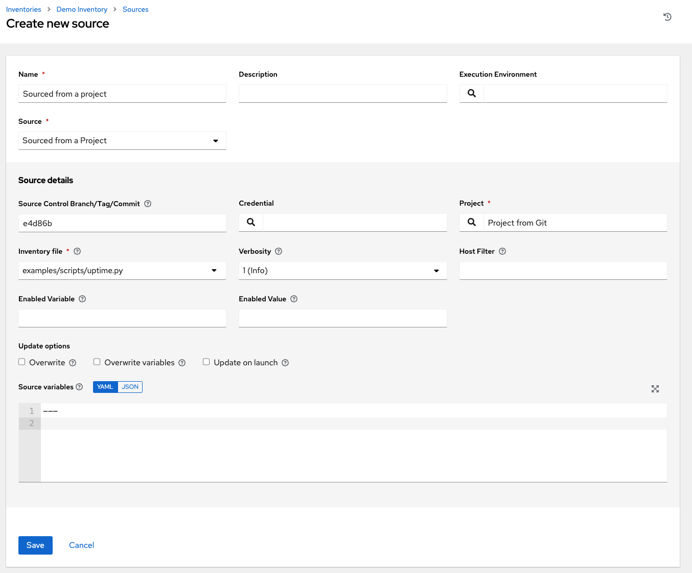

.. _ug_inventories_plugins:

Inventory Plugins
===================

.. index::
   pair: inventories; plugins

Inventory updates use dynamically-generated YAML files which are parsed by their respective inventory plugin. Users can provide the new style inventory plugin config directly to AWX via the inventory source ``source_vars`` for all the following inventory sources:

- :ref:`ag_inv_import`
- :ref:`ug_sourced_from_project`
- :ref:`ug_source_rhaap`

Newly created configurations for inventory sources will contain the default plugin configuration values. If you want your newly created inventory sources to match the output of legacy sources, you must apply a specific set of configuration values for that source. To ensure backward compatibility, AWX uses "templates" for each of these sources to force the output of inventory plugins into the legacy format. Refer to :ref:`ir_inv_plugin_templates_reference` section of this guide for each source and their respective templates to help you migrate to the new style inventory plugin output.

``source_vars`` that contain ``plugin: foo.bar.baz`` as a top-level key will be replaced with the appropriate fully-qualified inventory plugin name at runtime based on the ``InventorySource`` source. 

Inventory sources are not associated with groups. Spawned groups are top-level and may still have child groups, and all of these spawned groups may have hosts. Adding a source to an inventory only applies to standard inventories. Smart inventories inherit their source from the standard inventories they are associated with.

.. _ag_inv_import:

Inventory File Importing
-------------------------

.. index::
   single: inventory file importing
   single: inventory scripts; custom

AWX allows you to choose an inventory file from source control, rather than creating one from scratch. This function is the same as custom inventory scripts, except that the contents are obtained from source control instead of editing their contents browser. This means, the files are non-editable and as inventories are updated at the source, the inventories within the projects are also updated accordingly, including the ``group_vars`` and ``host_vars`` files or directory associated with them. SCM types can consume both inventory files and scripts, the overlap between inventory files and custom types in that both do scripts.

Any imported hosts will have a description of "imported" by default. This can be overridden by setting the ``_awx_description`` variable on a given host. For example, if importing from a sourced .ini file, you could add the following host variables:

::

   [main]
   127.0.0.1 _awx_description="my host 1"
   127.0.0.2 _awx_description="my host 2"

Similarly, group descriptions also default to "imported", but can be overridden by the ``_awx_description`` as well.

In order to use old inventory scripts in source control, see :ref:`ug_customscripts` for detail.

Custom Dynamic Inventory Scripts
~~~~~~~~~~~~~~~~~~~~~~~~~~~~~~~~~

A custom dynamic inventory script stored in version control can be imported and run. This makes it much easier to make changes to an inventory script — rather than having to copy and paste one into AWX, it is pulled directly from source control and then executed. The script must be written to handle any credentials needed for doing its work and you are responsible for installing any Python libraries needed by the script (which is the same requirement for custom dynamic inventory scripts). And this applies to both user-defined inventory source scripts and SCM sources as they are both exposed to Ansible *virtualenv* requirements related to playbooks.

You can specify environment variables when you edit the SCM inventory source itself. For some scripts, this will be sufficient, however, this is not a secure way to store secret information that gives access to cloud providers or inventory.

The better way is to create a new credential type for the inventory script you are going to use. The credential type will need to specify all the necessary types of inputs. Then, when you create a credential of this type, the secrets will be stored in an encrypted form. If you apply that credential to the inventory source, the script will have access to those inputs like environment variables or files. 

For more detail, refer to :ref:`Credential types <ug_credentials_cred_types>`.

SCM Inventory Source Fields
~~~~~~~~~~~~~~~~~~~~~~~~~~~~

The source fields used are:

- ``source_project``: project to use

- ``source_path``: relative path inside the project indicating a directory or a file. If left blank, "" is still a relative path indicating the root directory of the project

- ``source_vars``: if set on a "file" type inventory source then they will be passed to the environment vars when running

An update of the project automatically triggers an inventory update where it is used. An update of the project is scheduled immediately after creation of the inventory source. Neither inventory nor project updates are blocked while a related job is running. In cases where you have a big project (around 10 GB), disk space on ``/tmp`` may be an issue.

You can specify a location manually in the AWX User Interface from the Create Inventory Source page. Refer to the :ref:`ug_inventories_add_source` for detail. 

This listing should be refreshed to latest SCM info on a project update. If no inventory sources use a project as an SCM inventory source, then the inventory listing may not be refreshed on update.

For inventories with SCM sources, the Job Details page for inventory updates show a status indicator for the project update as well as the name of the project. The status indicator links to the project update job. The project name links to the project.

An inventory update can be performed while a related job is running.

Supported File Syntax
^^^^^^^^^^^^^^^^^^^^^^

AWX uses the ``ansible-inventory`` module from Ansible to process inventory files, and supports all valid inventory syntax that AWX requires.

.. _ug_sourced_from_project:

Sourced from a Project
-------------------------

.. index::
   pair: inventories; project-sourced

An inventory that is sourced from a project means that is uses the SCM type from the project it is tied to. For example, if the project's source is from GitHub, then the inventory will use the same source.

1. To configure a project-sourced inventory, select **Sourced from a Project** from the Source field.

2. The Create Source window expands with additional fields. Enter the following details:

  - **Source Control Branch/Tag/Commit**: Optionally enter the SCM branch, tags, commit hashes, arbitrary refs, or revision number (if applicable) from the source control (Git or Subversion) to checkout. Some commit hashes and refs may not be available unless you also provide a custom refspec in the next field. If left blank, the default is HEAD which is the last checked out Branch/Tag/Commit for this project. 

    This field only displays if the sourced project has the **Allow Branch Override** option checked.

  - **Credential**: Optionally specify the credential to use for this source.
  - **Project**: Required. Pre-populates with a default project, otherwise, specify the project this inventory is using as its source. Click the |search| button to choose from a list of projects. If the list is extensive, use the search to narrow the options.
  - **Inventory File**: Required. Select an inventory file associated with the sourced project. If not already populated, you can type it into the text field within the drop down menu to filter the extraneous file types. In addition to a flat file inventory, you can point to a directory or an inventory script.

.. |search| image:: _static/images/search-button.png

3. You can optionally specify the verbosity, host filter, enabled variable/value, and update options as described in the main procedure for :ref:`adding a source <ug_add_inv_common_fields>`.

4. In order to pass to the custom inventory script, you can optionally set environment variables in the **Environment Variables** field. You may also place inventory scripts in source control and then run it from a project. See :ref:`ag_inv_import` for detail.

|Inventories - create source - sourced from project example|

.. note:: If you are executing a custom inventory script from SCM, please make sure you set the execution bit (i.e. ``chmod +x``) on the script in your upstream source control. If you do not, AWX will throw a ``[Errno 13] Permission denied`` error upon execution.

.. _ug_source_rhaap:

Red Hat Ansible Automation Platform
------------------------------------

.. index::
   pair: inventories; Red Hat Ansible Automation Platform

1. To configure this type of sourced inventory, select **Red Hat Ansible Automation Platform** from the Source field.

2. The Create Source window expands with the required **Credential** field. Choose from an existing Ansible Automation Platform Credential.

3. You can optionally specify the verbosity, host filter, enabled variable/value, and update options as needed.

  .. image:: _static/images/inventories-create-source-rhaap-example.png
   :alt: Inventories create source Red Hat Ansible Automation Platform example

4. Use the **Source Variables** field to override variables used by the ``controller`` inventory plugin. Enter variables using either JSON or YAML syntax. Use the radio button to toggle between the two.
